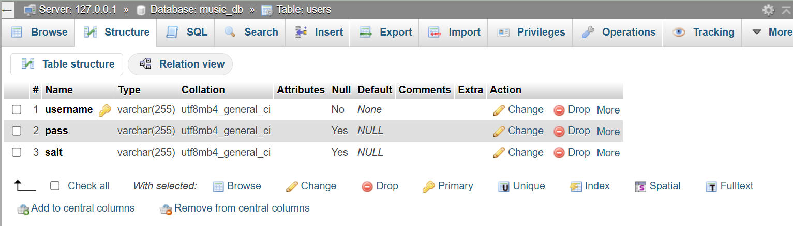
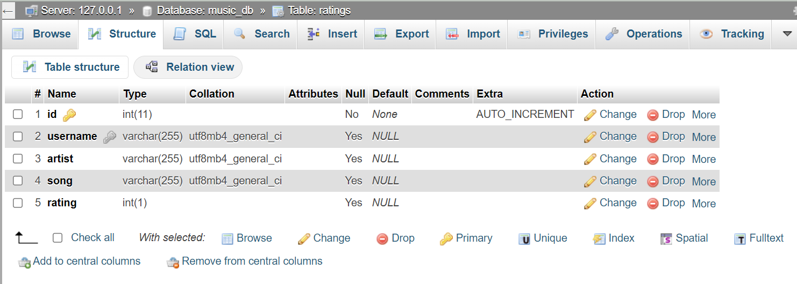

# comp333_hw3
Chi Phan and Nagena Latifi
This repository implements the PHP/MySQL backend for our k-pop music rating webapp via REST API and connects it to a JavaScript/React frontend. Our app allows users to:
- sign up and login/logout with authentication through PHPSESSID token
- view, add, update, and delete song ratings with title, artist, and rating
- new feature: search through existing ratings for specific artists and/or songs and filter by min and/or max star ratings

All the data is stored in music_db databse with two tables: users and ratings
Below is the structure for each table:

Our application is built on the Model-View-Controller (MVC) architecture, which organizes the code into three interconnected components:

Model: Responsible for managing the data and business logic of the application. It communicates with the database to fetch, insert, update, and delete records.
View: Provides the user interface which presents data to the user. In the context of a web application, views are often HTML templates with dynamic placeholders for data.
Controller: Acts as an intermediary between the Model and View. It processes incoming requests, interacts with the Model, and selects a View to render the page.

Our application provides a RESTful API, which complies with the principles of Representational State Transfer (REST) for communication between the client and the server. The key features are:

Stateless Interactions: Each API request from client to server must contain all the information the server needs to understand the request, without relying on any stored context on the server.
Resource-Based URLs: We expose our application's functionalities via URLs, such as /api/users or /api/ratings, representing resources in a structured format.
HTTP Methods: Our API uses standard HTTP methods to perform CRUD operations: GET to retrieve data, POST to create new records, PUT or PATCH to update existing data, and DELETE to remove data.
Response Codes: HTTP response codes are used to indicate the success or failure of an API request, with 200 series codes for success, 400 series for client errors, and 500 series for server errors.

There is a frontend (remixi) and backend directory containing the following noteworthy files:
remixi
    > src
        > Signin.js // Users use this to create an account before logging into the app
        > Login.js // Users use this to log into the app once they have created an account
        > HomePage.js // The main page that encompasses all features of the rating webapp, viewable once the user is logged in
        > ViewRating.js // Users use this when they click the view button to see the details of a rating
        > AddRating.js // Users use this to add new ratings to the ratings database
        > UpdateRating.js // Users use this when they click the update button to modify an existing rating
        > DeleteRating.js // Users use this when they click the delete button to remove a rating from the database
        > SearchRating.js // Users use this to search for ratings by artist, song, and min/max star ratings

backend
    > Controller/Api
        > BaseController.php // Base controller class that provides common functionality to all controllers
        > RatingController.php // Handles HTTP requests related to rating operations and invokes RatingModel methods
        > UserController.php // Handles HTTP requests related to user account operations and invokes UserModel methods
    > Model
        > Database.php // Provides database connection and query execution methods used by model classes
        > RatingModel.php // Contains the methods by which our app manages the data in the ratings database
        > UserModel.php // Contains the methods by which our app manages the data in the users database
    > index.php // Front controller that routes incoming HTTP requests to the appropriate controller actions

Important Note: the HomePage.js, Login.js, and Signup.js files may not be named correctly when first cloning the repository, please edit them to the above stated capitalization for App.js to work

How to run the file locally: First, start your MySQL Database and Apache Web Server in XAMPP. Copy the repository into htdocs. Then, run in the remixi folder by installing the packages "npm install" and start by 'npm start', edit paths as necessary for your local host

Credit: Our code was assisted by ChatGPT, fixed and synthesized by us.

50/50
